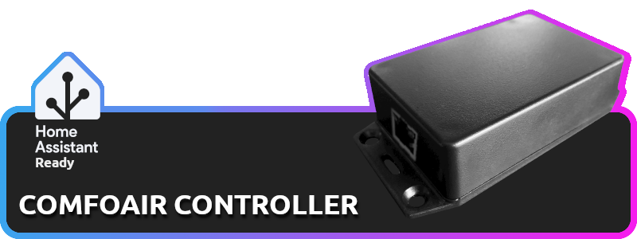

[](https://www.gnu.org/licenses/gpl-3.0) [](https://shop.svenar.nl)

ESPHome-powered controller for Zehnder WHR / CA ventilation units that integrate seamlessly with Home Assistant.

---


- **Comprehensive Climate Control**
  - 📊 Real-time fan speed monitoring
  - 🌡️ Multi-zone temperature tracking (Supply/Return/Exhaust/Outdoor)
  - ⚙️ Bypass & preheating status visualization
  - ↕️ Set ventilation level (Absent(Off) / Low / Medium / High)
  - 🌀 Set ventilation speed per level
  - ❄️ Frost protection monitoring
  - ⏲️ Operation hour tracking
  - 🏠 Home Assistant climate entity support
  - 🔄 Automatic firmware updates (Using ESPHome-builder)
  - ... and more

---


## ComfoAir Series
__Using:__ `comfoair_ca.yaml`
- Zehnder WHR 920
- Zehnder WHR 930
- Zehnder WHR 950
- Zehnder WHR 960
- Zehnder ComfoAir 160
- Zehnder ComfoAir 200
- Zehnder ComfoAir 350
- Zehnder ComfoAir 500
- Zehnder ComfoAir 550

## ComfoD Series
__Using:__ `comfoair_ca.yaml`
- Zehnder ComfoD 250
- Zehnder ComfoD 300
- Zehnder ComfoD 350
- Zehnder ComfoD 450
- Zehnder ComfoD 550

## ComfoAir Q Series
__Using:__ `comfoair_q.yaml`
- Zehnder ComfoAir Q350
- Zehnder ComfoAir Q450
- Zehnder ComfoAir Q600

---


Recommended hardware:
* ESP32 board
  * MAX3232 board for ComfoAir and ComfoD devices
  * SN65HVD230 board for ComfoAir Q devices
* 12V -> 3.3V converter (to power the ESP32 from the ComfoAir devices)

For plug-and-play solutions, visit [shop.svenar.nl](https://shop.svenar.nl)

---


## Using ESPHome CLI

https://esphome.io/guides/cli.html

### ComfoAir

```sh
$ esphome build comfoair_ca.yaml
$ esphome upload comfoair_ca.yaml
```

### ComfoAir Q

```sh
$ esphome build comfoair_q.yaml
$ esphome upload comfoair_q.yaml
```

## Using ESPHome-builder

https://esphome.io/guides/getting_started_hassio.html

1. Install the __ESPHome-builder__ add-on inside Home Assistant
2. Add the `comfoair_ca.yaml` or `comfoair_q.yaml` config
3. Build and upload

---


This project builds upon the foundational work by [Wichers](https://github.com/wichers/esphome-comfoair) and [yoziru](https://github.com/yoziru/esphome-zehnder-comfoair).

---


**License**: GNU General Public License v3.0 - See [LICENSE](LICENSE) for details.